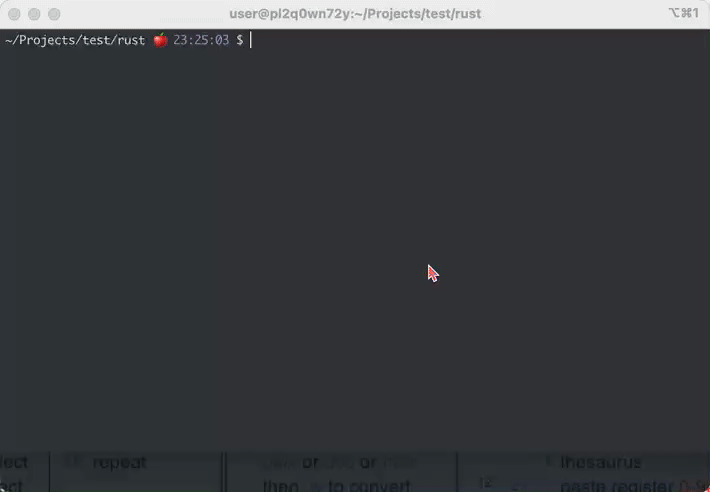
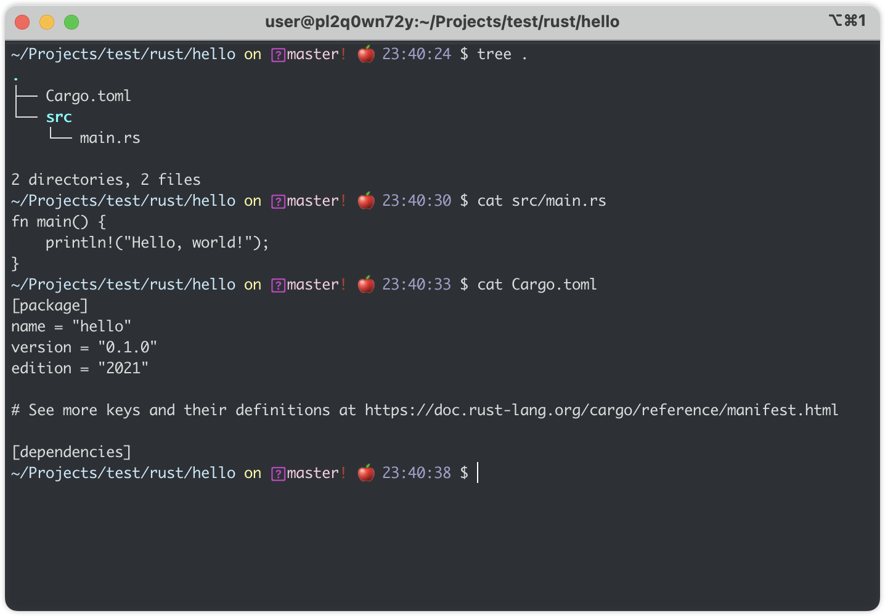
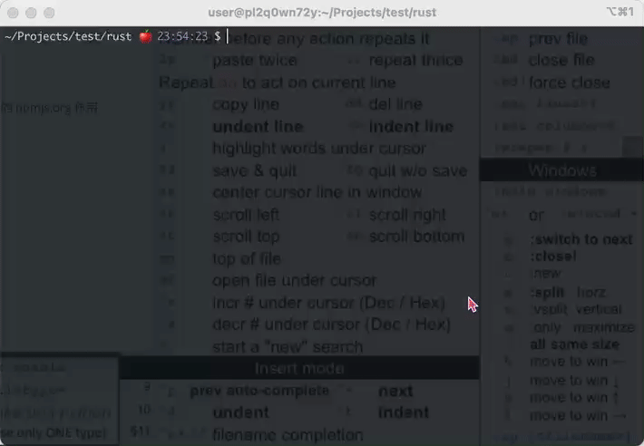
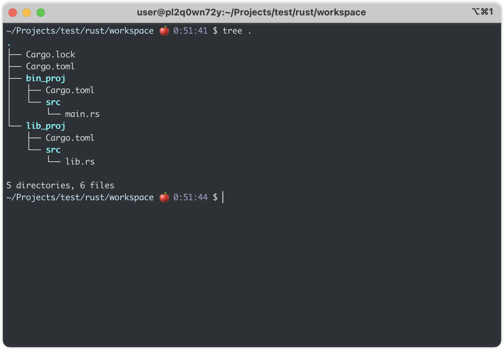
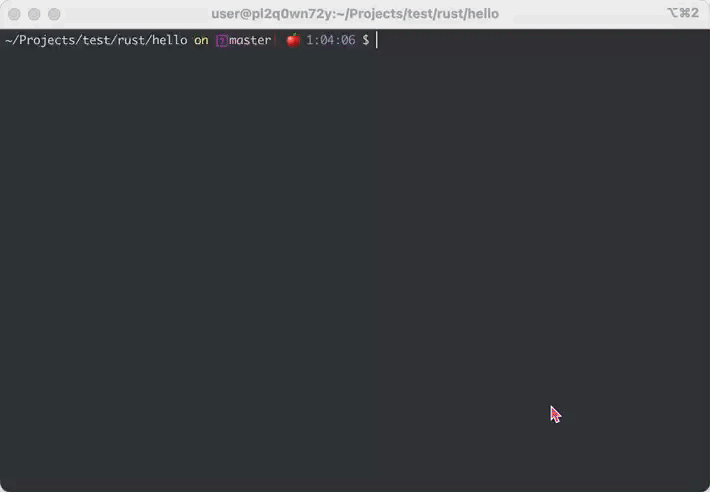
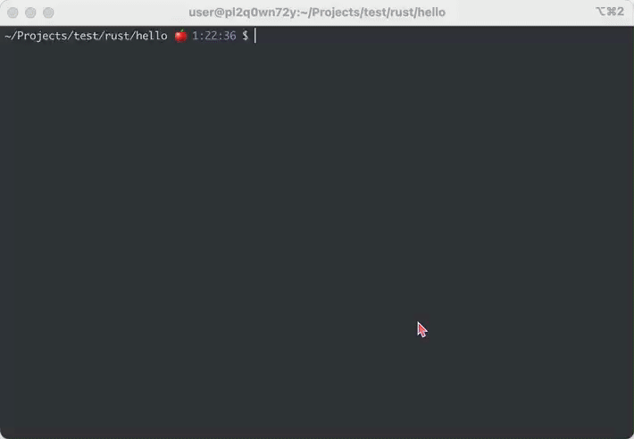
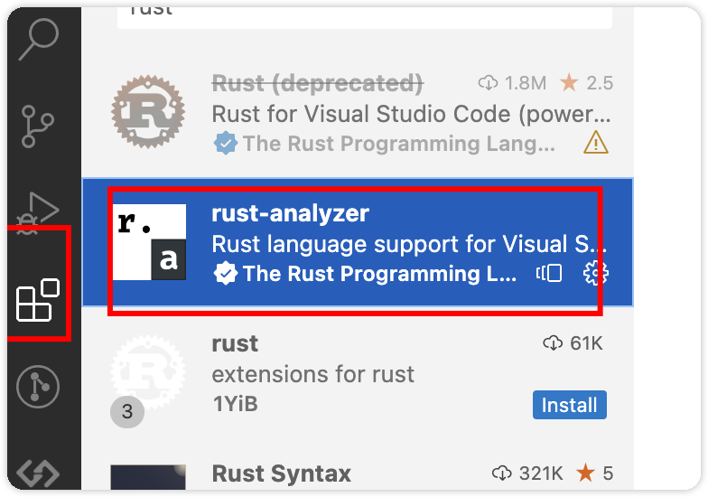
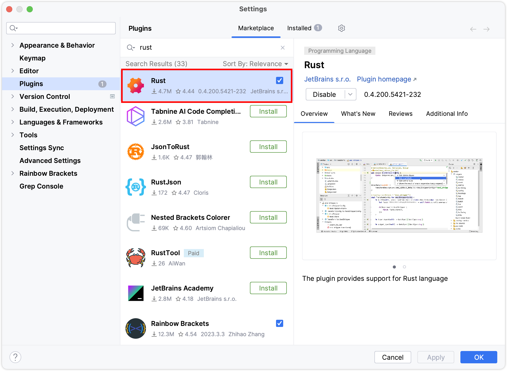

### 一、基本使用

刚开始入门 rust 的时候，只需要使用普通的文本编辑器，例如 windows 的文本文档，mac 的 textEdit 等（linux 我不知道不同发行版的文本编辑器是什么，当然可以使用vi、vim、emacs等），在已经通过[官网]([Install Rust - Rust Programming Language (rust-lang.org)](https://www.rust-lang.org/tools/install))安装过 rust 且配置好相关环境变量后，可以使用 rustc 进行编译，然后使用 `./文件名` 运行，下面以一个简单的 `hello world` 程序说明

1、打开文本编辑器，并输入以下代码，输入完成后保存到适合的位置，并将文件命名为`hello.rs`

```rust
fn main() {
    println!("Hello, world!");
}
```

2、打开终端（win上可以使用powershell或者cmd），然后进入到第一步中文件说保存的路径

3、在已经成功安装 rust 并且配置好环境变量的情况下，执行下面命令，如果没有任何的输出信息表示编译成功（有错误信息请检查前面提到的代码或者直接复制，同时检查 rust 是否成功安装）

```shell
rustc hello.rs
```

4、第三步成功执行后，会在同目录下生成名为`hello`的可执行文件，这时候只需要在终端执行 `./hello`就可以在终端上看到 `Hello, world!`的输出内容



### 二、Cargo使用

如果只写一些简单的代码，使用 rustc 完全可以胜任，但是如果需要对一个多文件，多功能或者说是较为复杂的项目进行操作时候，rustc 就显得能力不足了，这时候就需要使用 cargo 包管理工具来管理项目；只要正确安装 rust，并且配置好环境变量，则可以直接在终端使用`cargo`命令

和前面一样，做一个简单的`hello world`的示例

#### 1、创建项目

打开终端，选一个合适的目录，执行以下命令创建一个名为`hello`的项目

```shell
cargo new hello
```

进入到目录下，可以看到 cargo 已经为我们生成了基本的文件



其中 `src` 文件夹是存放源代码的地方，可以看到已经帮助我们生成了一个`main.rs`，同时也已经生成了我们要输出的`Hello, World!`;在生成的项目文件夹下还有一个`Cargo.toml`文件，这个文件里面包含了这个项目的基本信息

| key名称      | 说明                                                         |
| ------------ | ------------------------------------------------------------ |
| package      | 从图中可以看到，package前后有中括号包裹，这里`[package]` 可以认为是 toml 文件中的一个配置模块，主要说明了当前项目的一些基本信息 |
| dependencies | 此配置模块下包含了引用的其他模块，例如在同一项目下有多个模块，或者引用第三方模块 |
| name         | package.name 表示此项目的名称，默认和 `cargo new `时候的名称相同 |
| version      | package.version 表示当前项目的版本号                         |
| edition      | package.edition，这里是使用 cargo 命令创建项目时，这个项目所使用的稳定版的 rust 版本 |

注：

i、如果想要查询自己想要的库，可以到 https://crates.io/ 查询，这个站点作用和 java 的 maven repository，或者node 的 npmjs.org 作用是一样的。

ii、toml 文件中可以使用哪些配置项，可以参照[官方文档](https://doc.rust-lang.org/cargo/reference/manifest.html)。

#### 2、运行项目

在项目目录中使用`cargo run`运行项目，如果没有错误，可以看到输出了`Hello, world!`。



### 三、Cargo解释

前面通过 `cargo new`创建了一个简单的项目，并且通过`cargo run`运行了项目；

`cargo run`命令可以通过前面的图看到，实际上会先编译（这里用build），然后再运行代码；如果只想编译不想运行，可以执行`cargo build`命令；这样会根据 cargo.toml 文件中 dependencies 配置的信息，到仓库下载相关的包，并且编译代码。


上图中，如果使用 build 命令，可以看到会从远程拉取相关的包，并且生成  Cargo.lock文件，以及 target 文件夹；Cargo.lock 文件的作用类似于 node 项目中的 package-lock 或者 yarn.lock 文件（不知道也没关系）；主要作用就是锁定版本，举个例子，刚刚在 toml 文件中添加了一个 `rand = "0.8.5"`的包，这个包主要用于生成随机数，后面跟着他的版本号 0.8.5，其中有两个点分割成三部分，其格式为`major.minor.patch`，解释如下

| 名称  | 作用                                                     |
| ----- | -------------------------------------------------------- |
| major | 主版本号，当对项目进行重大更改时，则变动，习惯性加一     |
| minor | 次版本号，只在向后兼容的方式添加新的功能时候才变动       |
| patch | 补丁版本号，一般是修复错误，对原有功能的订正时候才会修改 |

以上三个数字，具体什么情况下变动，以什么样的方式变动也可以根据实际情况进行操作；

Cargo.lock 文件，会记录下当下执行 build 命令后的相关库的版本信息，当这个文件不删除时候，下次再次执行build时候，一般都会按照 lock 文件里面的版本号去本地、远程去拉取信息，即使指定的包第三方已经更新了，也不会主动去使用；如果想要使用新的包，可以使用`cargo update`命令，去更新，这个命令会更新 lock 文件里相关包版本号；如果在 toml 文件中，指定第三方包的版本号为 `*` 则使用这个包最新的版本号，不过一般不建议这样做，很容易因为第三方包一个大改动，导致原有项目的失败；也可以使用 `^1.2`前面加一个 ^符号，表示这个包可以取的版本号在 1.2 及以上版本。

target 文件夹主要包含了编译过程所生成的一些临时、最终文件（hello可执行文件），通过图中可以发现，第一，每次执行 build 命令后，都会在项目目录下生成 target 文件夹，而且默认会生成 debug 文件夹，里面会有一个和项目同名的可执行文件 `hello`；如果在执行build 命令的时候，添加`--release` 会在 target 目录下生成 release 文件夹，release 和 debug 文件夹里面的内容基本相同；如果默认生成 debug，在生成的文件里面会包含一些调试信息，而 release 版本，除了去除调试信息外，还对代码做了更多的优化。

前面提到的 build 命令会根据实际项目中的引用、内容等去生成相应的文件，在这个过程中，会先检查代码中的语法问题，然后没问题再生成相应的文件；有时候只是想看一下是否有语法错误，不想生成文件（因为耗费时间），这时候可以使用`cargo check` 命令，这时候只需要检查基本的代码问题，不会生成文件，可以节约时间。

---

`cargo new hello`会创建一个二进制项目，即可以直接运行的或者说是独立的一个项目，这个项目会包含一个 `main.rs`  文件作为整个项目的入口。除了二进制项目外，还可以创建库项目，库项目和二进制项目区别在于，二进制项目可以直接运行，库项目只能被别的项目依赖，或者通过测试（单元测试）的方式使用；如果想要创建一个库项目，可以使用 `--lib`参数，例如`cargo new tool --lib`这里创建了一个名为 tool 的库项目。

---

随着项目的增大，可能会将代码分割成不同的模块（程序库、库项目），但是不同模块本身是没有任何关联的，可以通过 toml 文件中的 workspace 下的 members 进行关联。下面说明并演示使用 workspace 

1、手动创建一个新文件夹，用于存放多个模块；

2、创建两个模块，一个库项目，一个是二进制项目；

3、分别为两个项目编写简单的代码并测试；




 需要注意一点，当使用 workspace 模式的时候，在子模块 bin、lib proj下面，不会生成 target，只会在 workspace 下面生成。

### 四、Cargo常用工具

#### 1、cargo-watch

这个工具会在编写代码的时候实时检查代码是否符合语法规范（实际上是会自动执行build操作）；`cargo install cargo-watch`会将 watch 工具安装到全局，然后再想要使用他的项目下执行 `cargo watch` 就可以实时监控。


#### 2、cargo-edit

这个工具会很方便的对相关依赖的管理，可以使用`cargo install cargo-edit` 来安装，安装后可以使用`cargo add`、`cargo rm`、`cargo edit`、`cargo upgrade` 对相关包进行管理



#### 3、cargo-outdated

如果项目中存在过期的依赖，通过这个命令就可以展示出来，可以通过 `cargo install cargo-outdated`安装。

#### 4、clippy

这个工具可以做build、check的工作来检查代码是否有语法问题，也可以帮助修复警告的内容，可以通过`rustup component add clippy` 来添加。


#### 5、rustfmt

这个工具主要就是起到格式化的作用，应该是 rust 自带的工具（记不清了，因为用ide的时候，基本使用ide的格式化功能）。



### 五、IDE以及基本配置

#### 1、vscode

比较轻量级，而且使用起来很方便，需要在 vscode插件市场搜索 rust-analyzer，可以看到图中第一个rust已经不推荐使用了，现在基本都会使用analyzer这个插件，可以有代码提示等功能。



#### 2、idea、clion

这两个都是一家出的工具，而且界面以及操作方式都差不多，用哪个都一样，不过idea里面集成的太多的java相关的插件，所以个人推荐使用clion



#### 3、其他ide

可参照[官方文档](https://www.rust-lang.org/tools)，常见的ide，例如eclipse、atom等都有相应的插件，可根据文档的描述进行安装。

### 六、总结

没了，又混了一篇；产出比较慢，尽量缩短吧，要不简单的内容时间线拉长了就没意思了。

