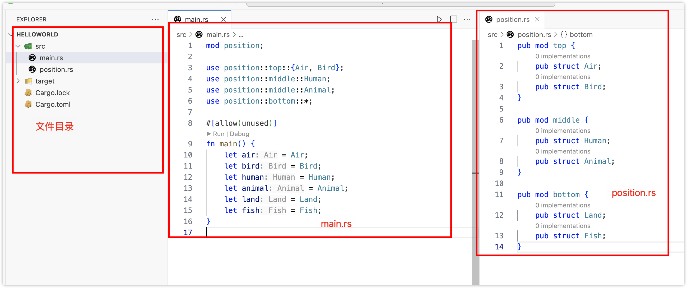

使用 Cargo 管理项目

cargo 相关介绍参照链接（08月19日发布的一篇）

官方介绍链接（[Introduction - The Cargo Book (rust-lang.org)](https://doc.rust-lang.org/cargo/)）

### 一、cargo使用以及相关参数介绍

#### 1.1 使用cargo 创建项目

使用下命令`cargo new <path>`，其中`<path>` 部分可以填写自己需要存放的路径，例如`cargo new ~/Desktop/helloworld`，这个命令会在桌面创建一个名称为 `helloworld` 的文件夹，里面包含了通过 cargo 创建的初始化文件，文件夹下的目录结构如下


这时候可以在项目根目录，通过`cargo run` 命令运行这个项目


#### 1.2 cargo new 命令参数说明

可以通过命令 `cargo new --help`查看详细的参数介绍


`--vcs`指定需要使用的版本控制系统（ version control system ），例如 git、hg（ Mercurial ）等，vcs 可以把代码存储在远程仓库，可以与其他人协作开发；使用 cargo new 创建项目的时候，默认使用 git，如果不想使用 vcs，可以在创建的时候使用 `cargo new helloworld --vcs none`。

`--bin`创建一个二进制(binary)项目，这里二进制项目指的是可以直接运行的，一个独立的项目，后面不需要添加参数，默认是这个参数，即`cargo new helloworld` 等价于 `cargo new helloworld --bin`。

`--lib`这个参数与前面 --bin 相对，bin 是创建一个可以直接运行的应用，而使用 lib 创建的是一个库（library），他自身是没有办法独立运行的，需要被引用到其他项目（模块）中，使用方式`cargo new helloworld --lib`，lib 和 bin 创建的项目在文件上的区别是，lib 方式在 src 文件夹下创建的是 lib.rs 文件，而 bin 方式创建的是 src/main.rs 文件。`cargo new helloworld --bin --lib`是不允许这样创建的，lib 和 bin 方式是互斥的，通过其他方式（例如手动）是可以让他们共存的，不过不推荐。

`--edition`这个是指定使用的 rust 的版本，后面是他可使用的参考值[2015, 2018, 2021]，不指定的话，我这里默认的是 2021 版本，推荐采用默认值。

`--name`包（模块）名称，目前通过 cargo  new 创建了独立的一个项目，所以，在 cargo.toml 文件中可以看到，name 的值就是 new 命令后面的名称，也是项目的根目录的名称，如果不想让项目名称和文件夹名称相同，可以使用这个参数。

`--registry`这个参数可以认为是一个大仓库，如果不指定这个参数，默认是crates.io，里面包含了其他人开发的库；也可以指定自己搭建的仓库或者指定其他第三方的仓库；一般情况下官方库足够学习和使用的。

`-q` 或 `--quiet`就像介绍的一样，添加了这个参数后，不会输出任何信息，直接创建所需的项目。

`-v` 或  `--verbose`与前面 q 参数相对，这个参数会输出详细的信息，cargo new 默认的就是这个参数

`--color` 创建的时候输出信息是否着色，可选项为 auto, always, never ，主要是输出信息回好看一些，对的错的信息都会用比较鲜明的颜色标记。默认是 auto。

`--config`可以参考 [Configuration - The Cargo Book (rust-lang.org)](https://doc.rust-lang.org/cargo/reference/config.html#command-line-overrides)

`-h` 或 `--help`输出帮助提示信息，如前面那张图所示。

其余参数我个人使用的较少所以未曾了解过，这里不做解释。

说明：前面提到的命令 `cargo new helloworld --bin` 可以将 `--bin`参数放到项目名称前面，例如`cargo new --bin helloworld`，这两种方式都可以，其他参数相同。

#### 1.3 toml 文件

toml 是配置文件的一种类型，和int、yml(yaml)、properties等文件类似；通过前面 new 命令创建项目后，默认的内容如下图


上图是通过 vscode 工具打开的，如果没有高亮相关配置，需要安装一个插件


toml 文件中默认的内容比较简单，例如，name 可以通过 new 命令的时候添加 --name 参数来指定，也可以在这个文件中手动去修改；version 是当前项目(功能、模块)的版本号，edition 可以通过 new 命令的时候添加 --edition 来指定，也可以在这边进行修改；

可以看到文件中有一个`[package]`表示接下来的一些信息是项目的一些基本（元）信息，除了上面的三个外，还可以包含authors（作者）、rust-version（rust支持的最小 rust 版本）、description（对项目的简单描述）、documentation（文档URL）等，更多可选参数，可参照官方链接[The Manifest Format - The Cargo Book (rust-lang.org)](https://doc.rust-lang.org/cargo/reference/manifest.html)

注意到 toml 文件中还有一个 `[dependencies]`，这个下面主要包含一些引入的第三方的包或者其他模块，例如如果需要随机函数的一个库，可以添加`rand = "0.8.5"`,具体有哪些版本可以用，可以在 crates.io 上面搜索 rand ，然后查看详情，会列出所有可用的版本，根据需要选择相应的版本号。


注意：cargo 创建出来的  version = "0.1.0"，版本号遵循语义版本控制系统，将以 `major.minor.patch` 格式指定，其中 major 为主版本号，只有在对项目进行新的重大更改时候才会变动；minor次版本号，在以向后兼容的方式添加新功能时变动；patch 修复错误、打补丁等才会变动；这里并不是绝对的，可以根据自己项目实际要求操作。

#### 1.4 运行项目

通过 new 命令创建项目后，假设创建的是 bin 类型项目，可以在项目根目录下执行`cargo run`，这个命令会先去编译项目，检查语法、下载相关依赖项（假设有的话），如果没有错误，则运行，并输出 `hello, world!`信息。


当执行完前面命令后，在项目根目录下有以下几个改变

1、生成 cargo.lock 文件，做过 node 项目的人应该很容易理解，他和 package.lock 、yarn.lock 作用一样，锁住版本号；例如指定了某一个库的最高版本是 0.8.x，今天最新的版本是 0.8.5，他会在 lock 文件中定下了，这个项目中再次下载以来的时候就是使用 0.8.5，到了第二天，这个库最新版本是 0.8.6 了，但是因为 lock 文件中已经定下了，所以，只要不修改或者重新生成，项目中使用第三方的库始终使用的是 0.8.5；

2、生成 target 文件夹，这个文件夹下包含了cargo run 命令的中间、最终文件（可执行文件）；如果代码没有修改，除了使用  cargo run 命令可以运行外，也可以找到 target/debug/helloworld 文件直接运行，如果前面执行 run 的时候添加了 --release 参数，则可执行文件是 target/release/helloworld 。

### 二、工作空间（区）以及模块介绍

#### 2.1 模块

##### 2.1.1 同一个文件中的模块

模块的定义我暂时不知道该怎么描述，可以先看以下代码示例，通过示例去理解模块。

下面只是简单的写了三个函数，然后被 main 调用

```rust
fn eat() {
    println!("Eating");
}

fn sleep() {
    println!("Sleeping");
}

fn code() {
    println!("Coding");
}

fn main() {
    eat();
    sleep();
    code();
}
```

将上面代码进行模块化（简单模块化）

```rust
// 我认为吃、睡、写代码都应该是人的行为，我就通过添加
// 关键字 mod ，然后后面添加一个名字，这个名字叫模块名
// 然后把前面三个函数丢到里面
mod person {
   // 注意到三个函数前面都增加了 pub 关键字
   // 因为加到模块里面后，默认只能被模块内的其他函数调用
    pub fn eat() {
        println!("Eating");
    }
    
    pub fn sleep() {
        println!("Sleeping");
    }
    
    pub fn code() {
        println!("Coding");
    }
}

// 将函数放到前面 mod 作用域后，需要使用 use 关键字引入到全局
// 作用域来使用，我这里引用了三个函数，如果只需要其中一个，可以只保留所需的
// 也可以使用拆分开的方式引入
// 例如：
// use person::eat;
// use person::sleep;
// use person::code;
// 下面一行引入要更简洁一些
use person::{eat, sleep, code};
// 需要注意一点，use person::{}，person 在最前面省略掉了 crate
// 写全了应该是 use crate::person::{}，因为 main 这边本来就是根了
// 所以加不加 crate 都可以

fn main() {
    eat();
    sleep();
    code();
}
```

上面是只有一层模块化的操作，下面给一个多层模块化的代码

```rust
// 下面是两层嵌套
mod position {
  // 用 top middle bottom 表示上中下，下面的示例不是很好
  // 不过用来理解 mod 的嵌套足够了
    pub mod top {
        pub struct Air;
        pub struct Bird;
    }

    pub mod middle {
        pub struct Human;
        pub struct Animal;
    }

    pub mod bottom {
        pub struct Land;
        pub struct Fish;
    }
}

// 下面三行引用方式前面见过了
use position::top::{Air, Bird};
use position::middle::Human;
use position::middle::Animal;
// 如果需要引入的过多，或者不多但是懒得像前面一样写那么多，
// 可以直接使用通配符 * 表示引入 bottom 下的所有东西（这里是结构体
// 也可以是函数等）
use position::bottom::*;

fn main() {
    let air = Air;
    let bird = Bird;
    let human = Human;
    let animal = Animal;
    let land = Land;
    let fish = Fish;
}
```

##### 2.1.2 跨文件的模块

前面是将模块写在了一个文件中，这样 main 函数可以直接调用，但是如果有其他文件使用相同的内容，那就需要把文件 copy 一份，放到对应的文件中，这样做可以解决问题，但是会有很多重复性的内容；这时候就需要把模块内容提取到一个公共的地方；

原来新建项目的时候只有一个 main.rs 代码文件，这时候在 src 文件夹下新建一个名字叫 position.rs 的文件，并将前面 position 模块的代码剪切过去

```rust
// position.rs
// 需要注意一下，这里top bottom middle 是顶级，不需要再加
// 原来外层的 position，这里文件名称 position.rs 中的 position
// 相当于原来的 mod position 中的 position
pub mod top {
    pub struct Air;
    pub struct Bird;
}

pub mod middle {
    pub struct Human;
    pub struct Animal;
}

pub mod bottom {
    pub struct Land;
    pub struct Fish;
}
```

```rust
// main.rs
// 这里的 position 是前面 position.rs 文件名称中的 position
// 作为模块名
mod position;

// 引入以及后面使用方式不变
use position::top::{Air, Bird};
use position::middle::Human;
use position::middle::Animal;
use position::bottom::*;

fn main() {
    let air = Air;
    let bird = Bird;
    let human = Human;
    let animal = Animal;
    let land = Land;
    let fish = Fish;
}
```

文件位置以及代码如下图（main.rs 文件中 #[allow(unused)] 为了避免下面未使用变量提示警告信息，我这里为了好看，也可以不添加 ）



补充：

```rust
mod position {
    pub mod top {
        pub fn top_func() {
            println!("top_func");
        }
    }

    pub mod bottom {
        pub fn bottom_func() {
          	// 这里注意一下，下面两行代码效果是一样的
            // 需要指出，self 是指向上找靠的最近的 mod，即 bottom
            // super 是当前模块  的  父模块，即 bottom 的 position
            // 所以如果不写，默认前面有一个 self 
            super::top::top_func();
            self::super::top::top_func();
        }
    }
}

// 下面没有区别
// 也可以写成 use crate::position::top::top_func;
use position::top::top_func;
use position::bottom::bottom_func;

fn main() {
    top_func();
    bottom_func();
}
```

除了前面提到的在 main 文件中添加模块，或者将一个文件作为一个模块，这里也可以将一个文件夹作为一个模块，如下面的代码和图所示

```rust
// main.rs
// 引入 postion 没有变，但是需要注意
// 如图所示，在 main 同级有一个 postion.rs 文件，以及同名的文件夹
mod position;

// 因为 position.rs 中通过 mod 引入后
// 再使用 pub use 导出的时候，top、bottom、middle 中的内容
// 已经成了 position 模块的根下的内容，所以下面
// 引入的时候 position 模块后，直接是后面的具体结构体
use position::{Air, Bird};
use position::Human;
use position::Animal;
use position::*;

#[allow(unused)]
fn main() {
    let air = Air;
    let bird = Bird;
    let human = Human;
    let animal = Animal;
    let land = Land;
    let fish = Fish;
}
```
```rust
// position.rs
// 下面三行模块名字与 position 文件夹下的三个文件同名
// 这三行是引入 import 的作用
mod top;
mod middle;
mod bottom;

// 下面这三行是导出 export 的作用
// 方便 mod position 的地方使用
pub use top::*;
pub use middle::*;
pub use bottom::*;
```
```rust
// top.rs
pub struct Air;
pub struct Bird;
```
```rust
// bottom.rs
pub struct Land;
pub struct Fish;
```
```rust
// middle.rs
pub struct Human;
pub struct Animal;
```


#### 2.2 工作空间（区）

随着时间推移，项目会越来越大，这时候就需要将项目拆分成独立的程序库，当然也可以拆分成模块，不过模块还是同属于一个项目，这样别人引入的时候也会引入很多没用的内容，所以就需要拆分成不同的程序，例如专门处理和数据库连接的，专门处理网络连接的，或者一些工具集的集合等，具体怎么分看自己的业务，自己的理念等，这里只是举一个例子来引入工作区的使用。

其实就是很多项目组合到一起来来开发、使用。

##### 2.2.1 创建工作区示例

分两步

1、找一个想存放的文件夹，右键新建文件夹，或者linux、mac 通过命令行 mkdir 创建文件夹，这里假设文件夹名称为 my_workspace；

2、进入 my_workspace 文件夹，然后新建 Cargo.toml 文件，并填写以下内容

```toml
[workspace]
memebers = ["my_lib", "app"]
#  这里意思是， my_workspace 是一个工作区间，其中包括两个应用，一个叫my_lib，一个叫 app
```

##### 2.2.2 创建成员应用

前面在 toml 文件中指定了两个应用名称，一个叫 my_lib，打算创建成程序库(cargo new --lib)，一个叫 app，撒算创建成一个二进制项目(cargo new --bin)

```shell
cargo new my_lib --lib
cargo new app
```

创建后的目录结构为


在创建的 my_lib 应用中的 lib.rs 文件中的默认内容如下

```rust
pub fn add(left: usize, right: usize) -> usize {
    left + right
}
// test 内容忽略
```

##### 2.2.3 相关引用

前面创建的 my_lib 是一个库项目，app 是一个二进制项目可以直接运行，所以这里打算在 app 里面引用 my_lib ，然后调用已经写好的 add 函数；这时候需要在 ./app/Cargo.toml 中做如下修改

```toml
[dependencies]
my_lib ={ path = "../my_lib" }
# 后面的 my_lib 是文件夹名称，前面的 my_lib 对应的是
# my_lib/Cargo.toml 文件中 name 对应的名字
# 同时，前面的名字也是在 app 项目中使用时的名字
```

##### 2.2.4 调用并运行

在 app/src/main.rs 中添加如下代码

```rust

fn main() {
  // 在前面 toml 文件中添加依赖的时候可以认为已经执行过 mod 引入到当前项目了
  // 所以下面可以直接通过 my_lib 名称调用
  // 也可以在 main.rs 前面使用  use my_lib::app; 然后调用的时候 let result = add(1, 2);
    let result = my_lib::add(1, 2);
    println!("{}", result);
}
```


没了，东西不难，就是写的有点多，下一篇搞个比较完整的小示例。
